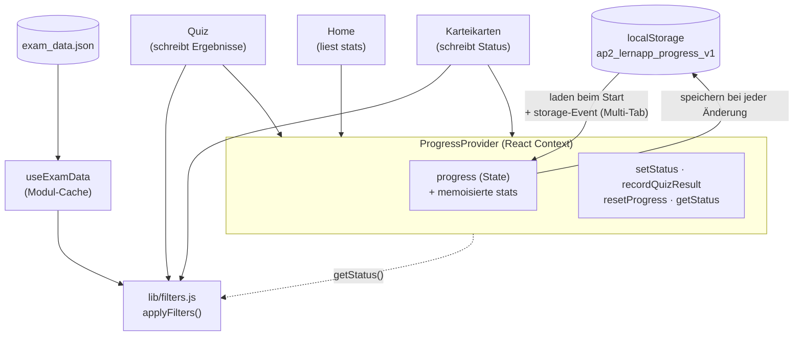

# AP Lernapp

Lokale Lern-Webapp zur Prüfungsvorbereitung der IT-Berufe (AO 2020), speziell
**Fachinformatiker für Systemintegration**. Sie deckt **AP1 (Teil 1 / GA1)** als
Grundlage und **AP2** ab und bietet mehrere Lernmodi über echte Prüfungsfragen und
themenbezogene Lernzettel: Karteikarten, Quiz, einen **Wiederholen-Modus mit Spaced
Repetition (Leitner)**, eine **Statistik**-Ansicht und eine **Volltextsuche**. Der
Fortschritt wird lokal im Browser (`localStorage`) gespeichert – keine Anmeldung,
kein Server, keine Cloud.

## Inhalt

- [Datenbestand](#datenbestand)
- [Funktionen](#funktionen)
- [Technologie-Stack](#technologie-stack)
- [Projektstruktur](#projektstruktur)
- [Architektur & Datenfluss](#architektur--datenfluss)
- [Setup & Entwicklung](#setup--entwicklung)
- [Deployment auf Proxmox (LXC + Nginx)](#deployment-auf-proxmox-lxc--nginx)
- [Troubleshooting](#troubleshooting)

## Datenbestand

Quelle ist eine gebündelte JSON-Datei (`src/data/exam_data.json`) mit zwei Bereichen:

**`exams`** – 6 Prüfungstermine (Frühjahr 2022, Herbst 2022, Frühjahr 2023, Herbst 2023,
Frühjahr 2024, Herbst 2025); jede Prüfung trägt `meta.pruefungsteil` (AP1/AP2).

| Kennzahl | Wert |
| --- | --- |
| Einträge insgesamt | 200 |
| davon reine Kontext-/Situationsblöcke | 22 |
| **lernbare Fragen** (in App genutzt) | **178** |
| Fragen mit hinterlegter Lösung | 107 |
| Themen-Tags | 17 |

**`lerneinheiten`** – **278 Lernzettel-Einheiten** (111 AP1 + 167 AP2), getrennt von den
Prüfungsfragen, je mit `kategorie`, `thema_tags`, `quelle` und `pruefungsteil`. Import
reproduzierbar über `scripts/import/*.mjs` aus den Quelldateien unter
`../Pruefungen_Rohdaten/`.

> **Hinweis:** Nicht für alle Fragen liegen offizielle Lösungen vor (besonders Frühjahr
> 2023/2024). Solche sind als „unverifiziert" markiert oder haben keine Lösung – dort
> hilft der Karteikarten-/Wiederholen-Modus zum Selbst-Nachschlagen. Reine Kontextblöcke
> (`ist_kontext_block: true`) werden in den Lernmodi ausgeblendet.

## Funktionen

- **Dashboard (Start):** Überblick über Lernstand (AP1 + AP2, Fragen + Lernzettel),
  Hinweis auf fällige Wiederholungen, Schnelleinstieg in alle Modi.
- **Heute lernen:** Ein Knopf startet eine **kurze, fertige Session** (10 Objekte) ohne
  Filterwahl – priorisiert Schwaches/Fälliges, füllt mit Neuem auf, klares Ende mit
  motivierender Auswertung. „Spürbar lernen, leicht anfühlen." (`pages/Lernen.jsx`,
  `lib/lernsession.js`).
- **Karteikarten:** Durch (gefilterte) Fragen blättern, **3D-Karten-Flip** zum Aufdecken,
  pro Karte als „Gelernt" oder „Muss ich üben" markieren (auch per Tastatur). Optionaler
  Zufalls-Modus mit „Neu mischen".
- **Lernzettel:** Eigene Seite für die themenbezogenen Spickzettel (AP1 + AP2) mit
  Filter nach Prüfungsteil/Kategorie/Thema/Status, Suche und Lese-/Markier-Modus.
- **Wiederholen (Spaced Repetition):** Leitner-System mit 5 Boxen über Fragen **und**
  Lernzettel. „Gewusst/Nicht gewusst" steuert Box und Fälligkeitsdatum; Sitzung
  filterbar nach Art/Teil/Kategorie/Thema und „nur fällige".
- **Quiz:** Fragenrunde mit Selbsteinschätzung (richtig / teilweise / falsch), am Ende
  Auswertung mit Prozent-Score und Aufschlüsselung nach Thema.
- **Klausur-Simulation:** Komplette Prüfung mit echten Fragen in Original-Reihenfolge,
  Freitext-Antworten und **flexibler Schlagwort-Prüfung** – auch abweichende
  Formulierungen/Synonyme zählen, Umlaute egal. Optionaler Timer (Prüfungsbedingungen),
  Auswertung mit Note-Tendenz und Themen-Schwächen, Übernahme in den Fortschritt.
  Schlagwort-Engine `src/lib/antwortpruefung.js`; Fragen-/Schlagwort-Format:
  [`docs/FRAGEN_SCHEMA.md`](docs/FRAGEN_SCHEMA.md).
- **Statistik:** Lernstand in %, Leitner-Box-Verteilung, Fälligkeit, Aufschlüsselung
  nach Prüfungsteil, Schwachstellen nach Thema und Lernverlauf pro Tag.
- **Motivation/Gamification:** Lern-**Streak** (Flamme in der Navbar), **Tagesziel** auf
  der Startseite, **XP & Level** (Fortschrittsbalken in der Statistik, Level-Chip auf der
  Startseite), **Aktivitäts-Heatmap** (GitHub-Stil) und sammelbare **Erfolge/Badges** in
  der Statistik; **Konfetti** bei bestandener Klausur. Logik rein & getestet
  (`src/lib/aktivitaet.js`, `src/lib/erfolge.js`, `src/lib/level.js`); Stand lokal in
  `localStorage`.
- **Tastatur-Bedienung:** Im Karteikarten-/Wiederholen-Modus per Tastatur (Leertaste =
  aufdecken, ← / → = blättern, 1 / 2 = bewerten) – Hook `src/hooks/useTastenkuerzel.js`.
- **Suche:** Globale Volltextsuche über Fragen, Lösungen und Lernzettel mit
  Treffer-Hervorhebung und Filter nach Art/Prüfungsteil.
- **Fortschritt:** Zentral gehalten, in `localStorage` persistiert, über mehrere
  Browser-Tabs synchron, jederzeit zurücksetzbar. Lernzettel nutzen denselben
  Mechanismus (Schlüssel = Einheit-ID).
- **Dark-/Light-Mode:** Umschalter in der Navigationsleiste; folgt ohne manuelle Wahl
  der System-Einstellung.
- **Markdown:** Frage- und Lösungstexte werden mit GitHub-Flavored-Markdown gerendert
  (Tabellen, Code-Blöcke, Listen). Tabellen und Code scrollen auf schmalen Screens
  horizontal statt das Layout zu sprengen.

## Technologie-Stack

- **React 19** + **Vite 6** (Build & Dev-Server)
- **Tailwind CSS 4** (`@tailwindcss/vite`-Plugin, Utility-First)
- **React Router 7** im **HashRouter**-Modus (`#/...`) – wichtig für statisches Hosting
  ohne Server-seitiges Routing
- **react-markdown** + **remark-gfm** für die Inhaltsdarstellung
- Persistenz ausschließlich über **`localStorage`** (kein Backend)

## Projektstruktur

```
lernapp/
├─ index.html                 # Einstiegspunkt (#root)
├─ vite.config.js             # Build- + Vitest-Konfig, env-basiertes `base`
├─ eslint.config.js
├─ package.json
├─ scripts/
│  ├─ backup-data.mjs         # Backup + Validierung von exam_data.json
│  ├─ migrations/             # Einmalige Datenmigrationen (z. B. pruefungsteil)
│  └─ import/                 # Lernzettel-Import (AP1-PDF, AP2-DOCX)
└─ src/
   ├─ main.jsx                # Mountet ThemeProvider > ProgressProvider > App
   ├─ App.jsx                 # Router, NavBar, ThemeToggle
   ├─ index.css               # Tailwind-Import, Dark-Variante, Markdown-Styling
   ├─ context/
   │  ├─ ProgressContext.jsx  # Single Source of Truth (Status + Leitner-SRS)
   │  └─ ThemeContext.jsx     # Hell-/Dunkel-Modus
   ├─ data/
   │  ├─ exam_data.json       # exams (200 Einträge) + lerneinheiten (278)
   │  ├─ useExamData.js       # Selektoren (Fragen, Tags, Termine, Lerneinheiten)
   │  ├─ lernobjekte.js       # Einheitliche Sicht Fragen+Lernzettel + Filter
   │  └─ useProgress.js       # @deprecated Re-Export aus ProgressContext
   ├─ lib/
   │  ├─ filters.js           # Reine Filterlogik (Prüfungsfragen)
   │  ├─ srs.js               # Leitner-Spaced-Repetition-Logik
   │  ├─ antwortpruefung.js   # Schlagwort-Matching-Engine (Klausur-Modus)
   │  ├─ lernsession.js       # „Heute lernen"-Session bauen (rein)
   │  ├─ aktivitaet.js        # Streak / Tagesziel / Heatmap (rein)
   │  ├─ erfolge.js           # Erfolge/Badges (regelbasiert, rein)
   │  ├─ level.js             # XP & Level (rein)
   │  ├─ bewertung.js         # Bewertungsstufen (Single Source of Truth)
   │  ├─ shuffle.js           # Fisher-Yates-Shuffle (rein, injizierbarer RNG)
   │  ├─ konfetti.js          # Feier-Moment (canvas-confetti, defensiv)
   │  └─ statistik.js         # Auswertungs-Kennzahlen
   ├─ hooks/
   │  └─ useTastenkuerzel.js  # Globale Tastatur-Kürzel (ignoriert Eingabefelder)
   ├─ components/
   │  ├─ FilterBar.jsx        # Filter-UI (kontrollierte Komponente)
   │  ├─ MarkdownContent.jsx  # Markdown-Renderer
   │  ├─ ProgressRing.jsx     # Animierter SVG-Fortschritts-Ring
   │  ├─ Heatmap.jsx          # Aktivitäts-Heatmap (CSS-Grid)
   │  └─ ErfolgWatcher.jsx    # Konfetti + Toast bei Badge-Freischaltung
   └─ pages/
      ├─ Home.jsx             # Dashboard (Überblick + Einstieg + Reset)
      ├─ Lernen.jsx           # „Heute lernen" – kurze, fertige Smart-Session
      ├─ Flashcards.jsx       # Karteikarten-Modus
      ├─ Lernzettel.jsx       # Lernzettel-Browser (Filter/Suche/Lesemodus)
      ├─ Wiederholen.jsx      # Spaced-Repetition-Sitzung (Leitner)
      ├─ Quiz.jsx             # Quiz-Modus + Auswertung
      ├─ Klausur.jsx          # Klausur-Simulation (Freitext + Schlagwort-Check)
      ├─ Statistik.jsx        # Fortschritts-/Schwachstellen-Auswertung
      └─ Suche.jsx            # Globale Volltextsuche
```

Zu jeder reinen Logik- und Seiten-Datei gibt es eine `*.test.js(x)`-Datei
(Vitest + Testing-Library).

## Architektur & Datenfluss

Der gesamte Lernfortschritt liegt in **einer** zentralen Quelle (`ProgressProvider`),
die alle Seiten gemeinsam nutzen. Dadurch ist eine im Quiz bewertete Frage sofort in der
Home-Statistik und im Filter sichtbar – ohne Reload und ohne dass einzelne Seiten
konkurrierend in `localStorage` schreiben.



**Wie `localStorage` mit Quiz- und Karteikarten-State zusammenspielt**

1. Beim App-Start lädt `ProgressProvider` den gespeicherten Fortschritt aus
   `localStorage` (Schlüssel `ap2_lernapp_progress_v1`). Defekte/fehlende Daten ergeben
   defensiv ein leeres Objekt.
2. Quiz und Karteikarten halten **eigenen, flüchtigen** UI-State (aktueller Index,
   aufgedeckt ja/nein, Quiz-Reihenfolge). Dieser State wird **nicht** persistiert – er
   gilt nur für die laufende Sitzung.
3. Sobald eine Frage bewertet/markiert wird, rufen die Seiten `setStatus` bzw.
   `recordQuizResult` aus dem Context auf. Der Context aktualisiert seinen zentralen
   State und schreibt ihn per Effekt zurück in `localStorage`.
4. Ein `storage`-Event-Listener übernimmt Änderungen aus anderen geöffneten Tabs, sodass
   alle Tabs denselben Stand zeigen.
5. `getStatus` ist bewusst **referenzstabil** (liest über eine Ref), damit die
   `useMemo`-Filter in Quiz/Karteikarten nicht bei jeder Bewertung neu durchlaufen.

Die Filterlogik (`lib/filters.js`) ist **rein** und React-frei: sie bekommt die
Fragenliste, die Filter und eine `getStatus`-Funktion injiziert und gibt die gefilterte
Liste zurück. Das macht sie leicht testbar und in Quiz, Karteikarten und Statistik
gleichermaßen verwendbar.

## Setup & Entwicklung

Voraussetzung: **Node.js ≥ 20** und npm.

```bash
# Abhängigkeiten installieren
npm install

# Dev-Server mit Hot-Reload starten (Standard: http://localhost:5173)
npm run dev

# Produktions-Build erzeugen (Ausgabe in dist/)
npm run build

# Build lokal testweise ausliefern
npm run preview

# Linting
npm run lint

# Tests (Vitest, einmalig bzw. Watch-Modus)
npm test
npm run test:watch

# Lerndaten sichern + validieren / nur validieren (CI)
npm run backup
npm run validate-data
```

> **Daten ändern:** Vor strukturellen Änderungen an `exam_data.json` `npm run backup`
> ausführen (legt eine Kopie in `data-backups/` an). Lernzettel werden nicht von Hand
> editiert, sondern über die Skripte in `scripts/import/` reproduzierbar neu erzeugt.

### Build für einen Unterpfad

Standardmäßig wird die App für die **Wurzel einer (Sub-)Domain** gebaut
(`base = "/"`, empfohlen für externe Nutzung). Soll sie unter einem Unterpfad laufen
(z. B. `https://server/lernapp/`), wird `base` über eine Umgebungsvariable gesetzt:

```bash
# Linux/macOS
VITE_BASE=/lernapp/ npm run build

# Windows PowerShell
$env:VITE_BASE="/lernapp/"; npm run build
```

Da die App **HashRouter** nutzt, betrifft `base` nur das Laden der JS/CSS-Assets, nicht
das clientseitige Routing (das läuft über `#/...` und braucht keine Server-Rewrites).

## Deployment

Es gibt zwei Wege:

1. **Voller Stack mit Konto/Sync (Docker):** Frontend + Backend (`server/`) zusammen
   per `docker compose up -d --build` (Caddy serviert das Frontend statisch, proxyt
   `/api` ans Backend und besorgt automatisch HTTPS). Schritte für Proxmox-LXC **und**
   VPS/Hostinger inkl. Empfehlung: siehe **[`../DEPLOYMENT.md`](../DEPLOYMENT.md)**.
2. **Nur Frontend (statisch, ohne Konto):** wie unten beschrieben – nur `dist/`
   ausliefern. Die Konto-Funktion ist dann inaktiv, alle Lernfunktionen laufen lokal.

### Statisch auf Proxmox (LXC + Nginx)

Die App ist eine rein statische Single-Page-Application. Es wird nur der Inhalt des
`dist/`-Ordners ausgeliefert – kein Node-Prozess auf dem Server nötig.

### 1. LXC-Container vorbereiten

Auf dem Proxmox-Host einen unprivilegierten Debian/Ubuntu-Container anlegen
(z. B. 1 vCPU, 512 MB RAM, 4 GB Disk genügen) und darin Nginx installieren:

```bash
apt update && apt install -y nginx
```

### 2. Build erzeugen und übertragen

Den Build auf dem Entwicklungsrechner erstellen (nicht im Container):

```bash
npm install
npm run build        # erzeugt dist/
```

Anschließend den `dist/`-Inhalt in das Web-Verzeichnis des Containers kopieren. `<CT-IP>`
durch die Container-IP ersetzen:

```bash
# Zielverzeichnis im Container anlegen
ssh root@<CT-IP> "mkdir -p /var/www/lernapp"

# dist-Inhalt übertragen (rsync entfernt mit --delete alte Dateien)
rsync -avz --delete dist/ root@<CT-IP>:/var/www/lernapp/

# Rechte setzen
ssh root@<CT-IP> "chown -R www-data:www-data /var/www/lernapp"
```

### 3. Verzeichnisstruktur auf dem Server

```
/var/www/lernapp/
├─ index.html
├─ favicon.svg
├─ icons.svg
└─ assets/
   ├─ index-<hash>.js
   └─ index-<hash>.css
```

### 4. Nginx Virtual Host (Root-Domain, empfohlen)

Datei `/etc/nginx/sites-available/lernapp` anlegen:

```nginx
server {
    listen 80;
    listen [::]:80;
    server_name lernapp.example.de;   # eigene (Sub-)Domain eintragen

    root /var/www/lernapp;
    index index.html;

    # HashRouter braucht keine SPA-Rewrites; index.html als Fallback
    # reicht aus und schadet nicht.
    location / {
        try_files $uri $uri/ /index.html;
    }

    # Gehashte Assets aggressiv cachen (Dateiname ändert sich bei jedem Build)
    location /assets/ {
        expires 1y;
        add_header Cache-Control "public, immutable";
    }

    gzip on;
    gzip_types text/css application/javascript image/svg+xml;
}
```

Aktivieren und neu laden:

```bash
ln -s /etc/nginx/sites-available/lernapp /etc/nginx/sites-enabled/lernapp
nginx -t            # Konfiguration prüfen
systemctl reload nginx
```

### Variante: Unterpfad statt eigener Domain

Soll die App unter `https://server/lernapp/` laufen, mit gesetztem `base` bauen
(`VITE_BASE=/lernapp/ npm run build`) und im bestehenden `server`-Block ergänzen:

```nginx
location /lernapp/ {
    alias /var/www/lernapp/;
    try_files $uri $uri/ /lernapp/index.html;
}
```

### HTTPS

Für externen Zugriff TLS aktivieren – am einfachsten per Let's Encrypt:

```bash
apt install -y certbot python3-certbot-nginx
certbot --nginx -d lernapp.example.de
```

Für den Zugriff von außen muss zusätzlich im Router/in der Firewall ein Port-Forward
oder Reverse-Proxy auf den Container zeigen.

## Troubleshooting

**Fortschritt zurücksetzen (z. B. bei „verklemmten" oder defekten Daten)**
In der App auf der Startseite „Fortschritt zurücksetzen" klicken und bestätigen.
Alternativ in der Browser-Konsole (F12):

```js
localStorage.removeItem('ap2_lernapp_progress_v1');
location.reload();
```

Der Theme-Schlüssel heißt `ap2_lernapp_theme_v1` und kann analog gelöscht werden.

**Leere/weiße Seite nach dem Deployment**
Fast immer ein falscher `base`-Pfad: Die App wurde für die Root-Domain gebaut, läuft aber
unter einem Unterpfad (oder umgekehrt). In den DevTools (Netzwerk-Tab) prüfen, ob die
`assets/*.js`-Dateien 404 liefern. Lösung: mit korrektem `VITE_BASE` neu bauen
(siehe [Build für einen Unterpfad](#build-für-einen-unterpfad)).

**JS lädt nicht / `text/html`-MIME-Fehler in der Konsole**
Nginx liefert `index.html` statt der JS-Datei aus (greifender Fallback). Prüfen, dass die
`assets/`-Dateien tatsächlich auf dem Server liegen und der `root`/`alias`-Pfad stimmt.

**Routing zeigt 404 bei direktem Aufruf einer Unterseite**
Sollte mit HashRouter (`#/quiz`) nicht auftreten. Falls doch URLs ohne `#` verwendet
werden, fehlt der `try_files … /index.html`-Fallback in der Nginx-Config.

**`npm run build` schlägt fehl wegen Node-Version**
Vite 6 benötigt Node ≥ 20. Version mit `node -v` prüfen und ggf. aktualisieren.

**Lint meldet `react-refresh/only-export-components`**
Betrifft nur den Dev-Hot-Reload, nicht den Build. In den Context-Dateien ist die Regel
bewusst per Kommentar deaktiviert, weil sie absichtlich Provider und Hook zusammen
exportieren.
